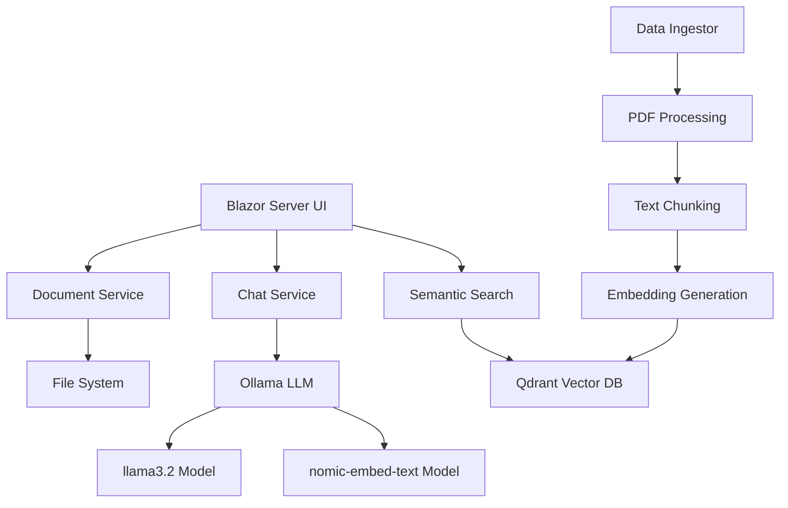

# ChatPDF - AI-Powered Document Chat Application

> **Transform your PDFs into conversational knowledge with AI-powered chat**

ChatPDF is a modern web application that allows users to upload PDF documents and engage in intelligent conversations about their content using advanced AI technologies. Built with .NET 9, Blazor Server, and cutting-edge AI tools, it provides a seamless experience for document analysis and information retrieval.


---

## 🚀 Features

### 📄 **Document Management**
- **Document Library**: Modern table view with search, sort, and filter capabilities
- **File Operations**: Download, view, and delete documents with confirmation dialogs
- **Real-time Updates**: Document count badges and status notifications

### 💬 **AI-Powered Chat**
- **Intelligent Conversations**: Ask questions about your PDF content in natural language
- **Contextual Responses**: AI provides accurate answers based on document content
- **Source Citations**: Each response includes citations with exact page references
- **Function Calling**: AI automatically searches relevant document sections

### 🎨 **Modern UI/UX**
- **Glassmorphism Design**: Beautiful modern interface with gradient backgrounds
- **Responsive Layout**: Optimized for desktop and mobile devices
- **Theme Ready**: Professional color scheme with purple/blue gradients
- **Interactive Elements**: Smooth animations and hover effects

### 🔧 **System Diagnostics**
- **Health Monitoring**: Built-in diagnostics page to test all system components
- **Component Testing**: Individual tests for documents, embeddings, search, and chat
- **Error Identification**: Detailed error reporting for troubleshooting

---

## 🏗️ Architecture

ChatPDF follows a modern microservices architecture leveraging the latest AI and database technologies:



### **Core Components**

#### **Frontend Layer**
- **Blazor Server**: Real-time interactive web UI with server-side rendering
- **Modern CSS**: Tailwind CSS with custom gradients and glassmorphism effects
- **Component Architecture**: Reusable Razor components for chat, documents, and navigation

#### **AI Integration Layer**
- **Microsoft.Extensions.AI**: Unified AI framework for .NET applications
- **Function Calling**: Automatic tool invocation for document search
- **Chat Client**: Seamless integration with language models

#### **Data Processing Pipeline**
- **PDF Ingestion**: Automatic document processing and text extraction
- **Text Chunking**: Intelligent document segmentation for optimal retrieval
- **Vector Generation**: Semantic embeddings for similarity search

#### **Storage Layer**
- **File System**: PDF document storage in organized directory structure
- **Vector Database**: High-performance similarity search with Qdrant

---

## 🧠 AI Technologies

### **Microsoft.Extensions.AI**
The backbone of ChatPDF's AI capabilities, providing:
- **Unified API**: Consistent interface across different AI providers
- **Function Calling**: Automatic tool invocation based on user queries
- **Streaming Support**: Real-time response generation
- **Observability**: Built-in telemetry and monitoring

```csharp
// Example: AI automatically calls search functions
chatOptions.Tools = [AIFunctionFactory.Create(SearchAsync)];
var response = await ChatClient.GetResponseAsync(messages, chatOptions);
```

### **Ollama Integration**
Local AI model hosting for privacy and performance:

#### **Language Model: llama3.2**
- **Purpose**: Primary chat and conversation model
- **Capabilities**: Natural language understanding, context awareness, function calling
- **Performance**: Optimized for conversational AI tasks

#### **Embedding Model: nomic-embed-text**
- **Purpose**: Convert text to high-dimensional vectors
- **Capabilities**: Semantic similarity, multilingual support
- **Vector Dimensions**: 768-dimensional embeddings for precise matching

```bash
# Download required models
ollama pull llama3.2
ollama pull nomic-embed-text
```

### **Vector Database: Qdrant**
High-performance vector storage and similarity search:

#### **Key Features**
- **Semantic Search**: Find relevant content based on meaning, not keywords
- **Scalability**: Efficient handling of large document collections
- **Real-time Updates**: Immediate availability of newly uploaded documents
- **Filtering**: Search within specific documents or date ranges

#### **Data Structure**
```json
{
  "id": "uuid",
  "vector": [0.1, -0.5, 0.9, ...], // 768 dimensions
  "payload": {
    "document_id": "research-paper.pdf",
    "page_number": 5,
    "text": "Machine learning algorithms...",
    "chunk_index": 12
  }
}
```

---

## 🔄 How It Works

### **1. Document Upload & Processing**
```
PDF Upload → Text Extraction → Chunking → Embedding Generation → Vector Storage
```

1. **Upload**: User uploads PDF through modern drag-drop interface
2. **Validation**: File type and size verification (max 10MB)
3. **Processing**: PDF text extraction and intelligent chunking
4. **Embedding**: Convert text chunks to vectors using `nomic-embed-text`
5. **Storage**: Save vectors to Qdrant with metadata (page numbers, document info)

### **2. AI Chat Interaction**
```
User Question → Semantic Search → Context Retrieval → LLM Processing → Response + Citations
```

1. **Question**: User asks about document content
2. **Search**: AI automatically searches relevant document sections
3. **Context**: Retrieve top matching chunks from vector database
4. **Generation**: LLM processes context and generates response
5. **Citations**: Include exact page references and quotes

### **3. Search & Retrieval Process**
```csharp
[Description("Searches for information using a phrase or keyword")]
private async Task<IEnumerable<string>> SearchAsync(string searchPhrase, string? filenameFilter = null)
{
    var results = await Search.SearchAsync(searchPhrase, filenameFilter, maxResults: 5);
    return results.Select(result =>
        $"<result filename=\"{result.DocumentId}\" page_number=\"{result.PageNumber}\">{result.Text}</result>");
}
```

---

## 🛠️ Prerequisites

### **Required Software**
- **.NET 9 SDK**: [Download here](https://dotnet.microsoft.com/download/dotnet/9.0)
- **Docker Desktop**: [Download here](https://www.docker.com/products/docker-desktop)
- **Ollama**: [Download here](https://ollama.ai/)

### **AI Models**
```bash
# Install required Ollama models
ollama pull llama3.2         # Chat model
ollama pull nomic-embed-text # Embedding model
```

### **Docker Services**
```bash
# Start Qdrant vector database
docker run -p 6333:6333 qdrant/qdrant

# Start Ollama (if not running natively)
docker run -p 11434:11434 ollama/ollama
```

---

## 🚀 Getting Started

### **1. Clone & Setup**
```bash
git clone <repository-url>
cd ChatPDF
```

### **2. Start Dependencies**
```bash
# Start Ollama
ollama serve

# Download models
ollama pull llama3.2
ollama pull nomic-embed-text

# Start Qdrant
docker run -p 6333:6333 qdrant/qdrant
```

### **3. Run Application**

#### **Visual Studio**
1. Open `ChatPDF-Ollama.sln`
2. Set `ChatPDF.AppHost` as startup project
3. Press `F5` or click "Start"

#### **Command Line**
```bash
cd ChatPDF.AppHost
dotnet run
```

#### **Visual Studio Code**
1. Install [C# Dev Kit extension](https://marketplace.visualstudio.com/items?itemName=ms-dotnettools.csdevkit)
2. Open project folder
3. Run from Debug view

### **4. Access Application**
- **Main App**: https://localhost:7002
- **Aspire Dashboard**: https://localhost:15888

---

## 🔧 Configuration

### **Application Settings** (`appsettings.json`)
```json
{
  "ConnectionStrings": {
    "vectordb": "Endpoint=http://localhost:6333",
    "chat": "Endpoint=http://localhost:11434",
    "embeddings": "Endpoint=http://localhost:11434"
  },
  "Ollama": {
    "Chat": {
      "ModelName": "llama3.2",
      "EnableFunctionInvocation": true
    },
    "Embeddings": {
      "ModelName": "nomic-embed-text"
    }
  },
  "Application": {
    "DataIngestion": {
      "PdfDirectory": "Data",
      "IngestOnStartup": true,
      "MaxFileSizeMB": 10
    }
  }
}
```

---

## 🧪 Testing & Diagnostics

### **Built-in Diagnostics**
Access `/diagnostics` to test system components:

1. **📄 Test Documents**: Verify PDF detection and file access
2. **🧠 Test Embeddings**: Check Ollama embedding service
3. **🔍 Test Search**: Validate Qdrant vector database
4. **💬 Test Chat**: Confirm language model connectivity

### **Common Issues**

| Issue | Symptoms | Solution |
|-------|----------|----------|
| Ollama Not Running | Embedding/Chat tests fail | `ollama serve` |
| Missing Models | Model-specific errors | `ollama pull llama3.2` |
| Qdrant Down | Search test fails | `docker run -p 6333:6333 qdrant/qdrant` |
| No Documents | Empty document list | Upload PDFs to `wwwroot/Data/` |

---

## 📁 Project Structure

```
ChatPDF/
├── ChatPDF.AppHost/          # .NET Aspire host project
├── ChatPDF.ServiceDefaults/  # Shared service configurations
├── ChatPDF.Web/             # Main Blazor Server application
│   ├── Components/
│   │   ├── Pages/
│   │   │   ├── Chat/         # Chat interface components
│   │   │   ├── Documents.razor # Document management
│   │   │   └── Diagnostics.razor # System testing
│   │   └── Layout/           # Navigation and layout
│   ├── Services/
│   │   ├── Ingestion/        # PDF processing pipeline
│   │   ├── DocumentService.cs # Document operations
│   │   └── SemanticSearch.cs # Vector search
│   └── wwwroot/
│       └── Data/             # PDF storage directory
└── README.md
```

---

## 🔒 Security Considerations

- **Local Processing**: All AI processing runs locally (no data sent to cloud)
- **File Validation**: Strict PDF file type and size checking
- **Input Sanitization**: Protection against prompt injection attacks
- **Access Control**: File system permissions and validation

---

## 🤝 Contributing

1. Fork the repository
2. Create a feature branch (`git checkout -b feature/amazing-feature`)
3. Commit your changes (`git commit -m 'Add amazing feature'`)
4. Push to the branch (`git push origin feature/amazing-feature`)
5. Open a Pull Request

---

## 📝 License

This project is licensed under the MIT License - see the [LICENSE](LICENSE) file for details.

---

## 🙏 Acknowledgments

- **Microsoft .NET Team**: For the excellent AI integration framework
- **Ollama**: For providing local AI model hosting
- **Qdrant**: For high-performance vector database technology
- **Blazor Community**: For the modern web framework

---

## 📞 Support

For questions, issues, or contributions:
- **Issues**: Open a GitHub issue
- **Discussions**: Use GitHub Discussions
- **Documentation**: Check `/diagnostics` for system health

---

**Built with ❤️ using .NET 9, Blazor Server, and cutting-edge AI technologies**